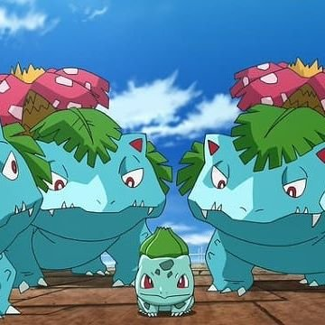

<p align="center">
  
</p>

<p align="center">작고 연약한 나와 그걸 지켜보는 근육몬들<p>

## 사용 기술 스택

<p align="center">
&nbsp;
&nbsp;
&nbsp;
&nbsp;
&nbsp;
&nbsp;
</p>

## Description

인스타그램 축소판 

## Installation

---
#### nest 프로젝트를 만들고 싶은 경우 (해당 없으면 스킵)

##### nestjs 전역 설치
 ```bash
 npm i -g @nestjs/cli
```
##### nestjs 프로젝트 생성
 ```bash
 nest new 'project name'
```
---
##### module 가져오기
 ```bash
  yarn install
```

## 어플리케이션 구동

```bash
# development
$ yarn start

# watch mode
$ yarn start:dev

# production mode
$ yarn start:prod
```

## Support

이상해씨 이상해풀 이상해꽃

